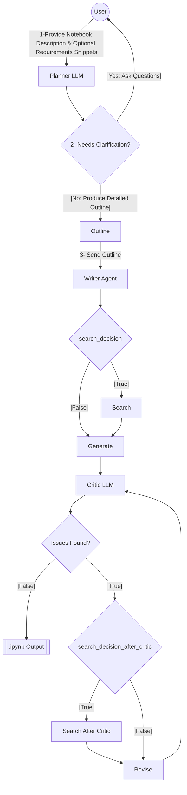

# Cookbook Agent


An AI-powered agent system for generating high-quality educational Jupyter notebooks about OpenAI APIs and AI development concepts.

## 📖 Overview

Cookbook Agent streamlines the creation of educational content through an AI-driven workflow:

1. **Planning**: Generates structured notebook outlines based on user requirements
2. **Writing**: Creates comprehensive content with code examples for each section
3. **Search Integration**: Leverages internet search to enrich content with up-to-date information
4. **Critique & Revision**: Automatically reviews and improves content quality through a feedback loop

Perfect for technical educators, API documentation teams, and developers learning to integrate AI capabilities into applications.

## ✨ Features

- **Interactive Clarification**: Uses tools to ask clarification questions when information is ambiguous or missing
- **Structured Outputs**: Utilizes OpenAI's structured outputs for type-safe content generation
- **Robust Error Handling**: Provides fallbacks and graceful error reporting
- **LangGraph Workflows**: Orchestrates complex agent interactions with state management
- **Search Integration**: Incorporates Tavily and OpenAI web search for up-to-date information
- **Multi-format Export**: Generates content in Markdown, Jupyter Notebook, Python script, and JSON formats
- **Auto-critique & Revision**: Self-reviews generated content for accuracy and completeness
- **User-friendly UI**: Streamlit-based interface for interacting with the agent system

## 🔧 Prerequisites

- Python 3.12+
- OpenAI API key
- Git (for cloning the repository)
- Virtual environment tool (venv, conda, etc.)
- Optional: Tavily API key (for enhanced search functionality)

## 🚀 Installation

### 1. Clone the repository

```bash
git clone https://github.com/yourusername/cookbook_agent.git
cd cookbook_agent
```

### 2. Set up a virtual environment

```bash
# Using venv (recommended)
python -m venv venv
source venv/bin/activate  # On Windows: venv\Scripts\activate

# OR using conda
conda create -n cookbook_agent python=3.12
conda activate cookbook_agent
```

### 3. Install the package

```bash
# Using the installation script
./install.sh

# OR manually
pip install -e .
pip install -r requirements.txt
```

### 4. Set up environment variables

Create a `.env` file in the project root with your API keys:

```
OPENAI_API_KEY=your_openai_api_key

# Optional: For Tavily search
TAVILY_API_KEY=your_tavily_api_key

# Optional: For LangSmith tracing
LANGSMITH_TRACING=true
LANGSMITH_API_KEY=your_langsmith_api_key
LANGSMITH_PROJECT=cookbook_agent
```

## 🖥️ Usage

### Command Line Interface

Run the main application to generate a notebook plan:

```bash
python main.py
```

This will:
1. Prompt you for notebook requirements
2. Ask clarification questions if needed
3. Generate a structured notebook plan
4. Save the plan to `notebook_plan.md`

### Streamlit UI (Recommended)

The project includes a user-friendly Streamlit interface for a more interactive experience:

```bash
streamlit run ui/app.py
```


### Generate Notebook Content from Plan

Once you have a plan, use the WriterAgent to generate content:

```bash
python -m src.tests.test_writer --plan notebook_plan.md --output ./output
```

Options:
- `--model <model_name>`: Specify the OpenAI model to use (default: gpt-4o)
- `--section <index>`: Generate content for a specific section only (0-based index)
- `--parse-only`: Only parse the plan without generating content
- `--max-retries <value>`: Maximum number of retries for content generation (default: 3)

Example:
```bash
python -m src.tests.test_writer --model gpt-4o --plan ./data/agents_sdk_plan.md
```

### Output Files

Generated content is saved to the specified output directory (default: `./output`):
- `<notebook_title>_plan.md`: The markdown version of the notebook plan
- `<notebook_title>_final.ipynb`: Jupyter Notebook version of the generated content
- `<notebook_title>_final.py`: Python script version of the generated content
- `<notebook_title>_final.md`: Markdown version of the generated content
- `<notebook_title>_critique.md`: Critique generated by the AI reviewer (when critique is enabled)
- `<notebook_title>_original.ipynb`: Original version before critique (when critique is enabled)
- `<notebook_title>_original.py`: Original Python version before critique (when critique is enabled)
- `<notebook_title>_original.md`: Original Markdown version before critique (when critique is enabled)
- `section_<n>_<section_title>.json`: Individual section content in JSON format

The output filenames use lowercase with underscores replacing spaces for better compatibility across systems.

## 📊 LangSmith Tracing

This project uses LangSmith for tracing and monitoring. To enable tracing:

1. Create a LangSmith account at https://smith.langchain.com/
2. Copy your API key from the LangSmith dashboard
3. Set up environment variables in your `.env` file:
   ```
   LANGSMITH_TRACING=true
   LANGSMITH_API_KEY=your_langsmith_api_key_here
   LANGSMITH_PROJECT=your_langsmith_project_name_here
   ```

LangSmith integration enables visualization of the entire generation workflow, including:
- Agent decision-making processes
- Content generation steps
- Critique and revision cycles
- Search operations and their results

## 🤖 Agent Workflow



## 📁 Project Structure

```
cookbook_agent/
├── main.py                 # Main CLI entry point
├── setup.py                # Package setup
├── install.sh              # Installation script
├── requirements.txt        # Project dependencies
├── .env.example            # Example environment variables
├── ui/                     # Streamlit UI components
│   ├── app.py              # Main Streamlit application
│   ├── styles.py           # UI styling
│   └── __init__.py         # Package initialization
├── .streamlit/             # Streamlit configuration
│   └── config.toml         # Theme and server settings
├── data/                   # Test data and examples
├── image/                  # Project images
├── output/                 # Output directory
└── src/                    # Source code
    ├── __init__.py         # Package initialization
    ├── models.py           # Pydantic models
    ├── planner.py          # PlannerLLM implementation
    ├── searcher.py         # Search functionality
    ├── writer.py           # WriterAgent implementation
    ├── user_input.py       # User input handling
    ├── format/             # Formatting utilities
    │   ├── __init__.py
    │   ├── core_utils.py   # Basic utility functions
    │   ├── markdown_utils.py  # Markdown formatting
    │   ├── notebook_utils.py  # Notebook conversion
    │   ├── prompt_utils.py    # Prompt formatting
    │   ├── plan_format.py     # Plan formatting
    │   └── format_utils.py    # Compatibility re-exports
    ├── prompts/            # Prompt templates
    │   ├── __init__.py
    │   ├── planner_prompts.py
    │   ├── writer_prompts.py
    │   ├── critic_prompts.py
    │   └── search_prompts.py
    ├── tools/              # LLM tools
    │   ├── clarification_tools.py
    │   ├── debug.py
    │   └── utils.py
    ├── utils/              # Utility functions
    └── tests/              # Test modules
        ├── __init__.py
        ├── test_planner.py
        ├── test_writer.py
        ├── test_searcher.py
        └── test_format.py
```

## 💻 UI Features

The Streamlit UI offers a comprehensive interface for working with Cookbook Agent:

### Plan Creation and Editing
- **Intuitive Form Interface**: Create and modify notebook plans with structured forms
- **Section Management**: Add, remove, and reorder sections and subsections
- **Real-time Preview**: See how your notebook structure evolves as you edit

### Content Generation
- **Interactive Generation**: Generate content with real-time progress updates
- **Section-by-Section Generation**: Choose to generate specific sections or the entire notebook
- **Advanced Settings**: Configure generation parameters like model selection and search options

### Output Management
- **Multi-format Preview**: View generated content in Markdown, code, or notebook format
- **Export Options**: Save notebooks as .ipynb, .md, or .py files
- **Project Management**: Save and load projects for continued work

### Search Integration
- **Automatic Research**: Enhance content with internet search when needed
- **Source Citation**: Include references to external sources in generated content


## 🧪 Testing

The Cookbook Agent project includes several test modules to verify functionality of different components:

- `test_planner.py`: Tests the notebook planning functionality
- `test_writer.py`: Tests the content generation (most commonly used)
- `test_searcher.py`: Tests the search integration
- `test_format.py`: Tests the format conversion utilities

For detailed instructions on running tests, available parameters, and what to expect, see the [test documentation](./src/tests/README.md).

Basic writer test example:
```bash
# Generate notebook content from a plan
python -m src.tests.test_writer --plan ./data/agents_sdk_plan.md --output ./output
``` 

## Examples
These are a few cookbooks generated by the Agentic System:
- [Multi-agent with Tool Use Cookbook](example/Building_a_Multi-Agent_Framework_Using_OpenAI's_Agents_SDK.ipynb)

## 🤝 Contributing

Contributions are welcome! Please feel free to submit a Pull Request.

1. Fork the repository
2. Create your feature branch (`git checkout -b feature/amazing-feature`)
3. Commit your changes (`git commit -m 'Add some amazing feature'`)
4. Push to the branch (`git push origin feature/amazing-feature`)
5. Open a Pull Request

## 📄 License

This project is licensed under the MIT License - see the LICENSE file for details.