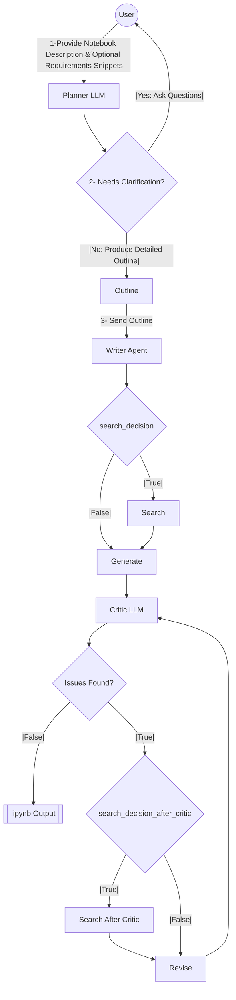

```mermaid
flowchart TD
    A((User))
    A -->|1-Provide Notebook Description & Optional Requirements Snippets| B[Planner LLM]
    B --> C{2- Needs Clarification?}
    C --|Yes: Ask Questions|--> A
    C --|No: Produce Detailed Outline|--> D[Outline]
    D -->|3- Send Outline| E[Writer Agent]
    E --> F{search_decision}
    F --|True|--> G[Search]
    F --|False|--> H[Generate]
    G --> H
    H --> I[Critic LLM]
    I --> J{Issues Found?}
    J --|False|--> K[[.ipynb Output]]
    J --|True|--> L{search_decision_after_critic}
    L --|True|--> M[Search After Critic]
    M --> N[Revise]
    L --|False|--> N
    N --> I
```